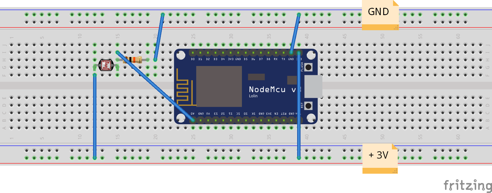
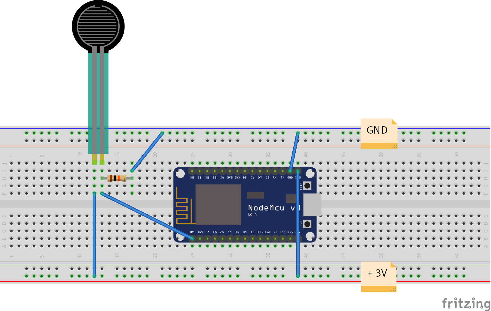

# ESP8266

Get the current light intensity with a ESP8266 and a photocell and display it on a webpage with the IP address.

Get also the current pressure with a ESP8266 and a force sensitive resistor and display it on a webpage with the IP address.

Next you could set a domotic system that switch on/off lights in your home.

It can be used with other digital sensors because the ESP8266 has only one Analogic Digital Converter pin (ADC0).

## ESP8266 card

## Setup WiFi

Write your SSID and password in [webServerManager.h](webServerManager.h).

## Photocell

### Components

[Photocell](https://learn.adafruit.com/photocells/overview)

Resistor 10KΩ

### Cabling

### To add to [ESP8266.ino](ESP8266.ino)

`#include "lightManager.h`

`server.on(URL_POST_LIGHT_STATE, handleLightState);`

### Get Light State

Go to http:// *yourESP8266IP* /api/embedded_light/state?embedded_light_api_key=ppDk0rATHKv8vyqlzjvVnNIYc

## Force Sensitive Resistor

### Components

[Force Sensitive Resistor](https://learn.adafruit.com/force-sensitive-resistor-fsr/using-an-fsr)

Resistor 10KΩ

### Cabling

### To add to [ESP8266.ino](ESP8266.ino)

`#include "pressureManager.h`

`server.on(URL_POST_PRESSURE_STATE, handlePressureState);`

### Get Pressure State

Go to http:// *yourESP8266IP* /api/embedded_light/state?embedded_light_api_key=ppDk0rATHKv8vyqlzjvVnLpBj
